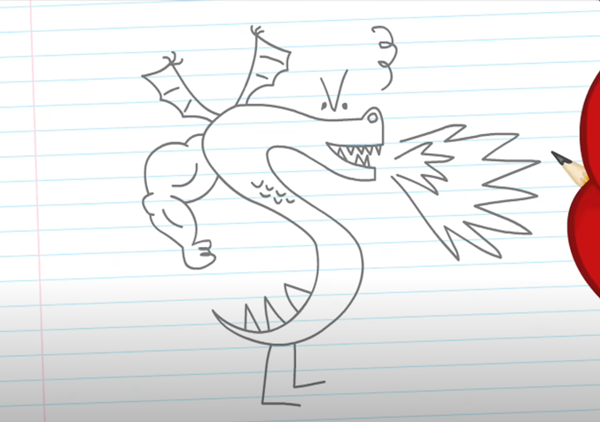

# DRAGON

The Burninator

## Table of Contents

[About](#about)
[Features](#features)
[Installation](#installation)
[Dependencies](#dependencies)
[Getting Started](#usage-getting-started)
[Frequently Asked Questions](#frequently-asked-questions)
null
[Plans for Future Development](#plans-for-future-development)
[Report Issues](#report-issues)
[How to Contribute](#how-to-contribute)
[License](#license)
[About the Author](#about-the-author)

## Description

### About

DRAGON is here to help your child show off their skils of an artist! Follow along with my simple step-by-step instructions. I make drawing FUN! If you know your letters S and V and what a few body parts look like, you'll have a dragon in no time!

### Features

Smoke, Fire, Wings, Angry Eyebrows, and a Big Beefy Arm (for good measure)

### Watch nkdjnskjs in Action

## Documentation

### Installation

To install, type strongbad_email.exe from the command line.

### Dependencies

none

### Usage: Getting Started

Get a pencil and some paper. To begin, draw an S. Then a more different S...

## Frequently Asked Questions

Q: Do I need to use chiaroscuro shading when drawing my dragon?
A: No!
Q: Should I give my dragon a name?
A: Yes. You shall name him Trogdor.
Q: What if my dragon doesn't look as good as the other students' drawings?
A: Don't worry about them. They wouldn't know majesty if it came up and bit them in the face.

## Plans for Future Development

Currently working on a new module that lets you release your Trogdor dragon into the countryside where it will burninate the peasants and their thatched roof COTTAGES!!!

## Report Issues

[Email me at](strongbad@homestarrunner.com)

## How to Contribute

Post your dragon drawings on Instagram and tag #Trogdor and #Strongbad

## License

Licensed under [GNU](https://choosealicense.com/licenses/GNU)

## About the Author

### Name

Strong Bad

### GitHub

Ask-StrongBad

### Email

[Email](strongbad@homestarrunner.com)

### LinkedIn

n/a

### Portfolio

[Portfolio](https://homestarrunner.com/sbemails)

### About Author

Strong Bad is a character from the web cartoon series “Homestar Runner.” He’s known for his sarcastic demeanor, wrestling mask, and his email responses, which often involve him answering fan emails in a humorous and sometimes nonsensical way. Homestar Runner gained popularity in the early 2000s when internet animation was becoming more widespread and mainstream. Its peak popularity was from the early 2000s to around 2006.
