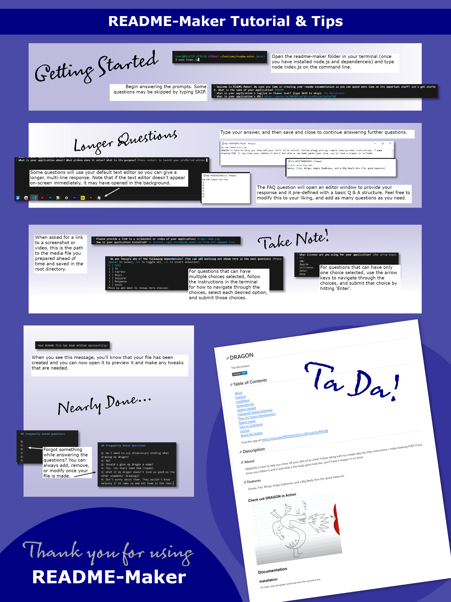

# README-Maker

We save you time in creating your readme documentation so you can spend more time on the important stuff

## Table of Contents

[About](#about)  
[Features](#features)  
[Installation](#installation)  
[Dependencies](#dependencies)  
[Getting Started](#usage-getting-started)  
[Frequently Asked Questions](#frequently-asked-questions)  
[Plans for Future Development](#plans-for-future-development)  
[Report Issues](#report-issues)  
[How to Contribute](#how-to-contribute)  
[License](#license)  
[About the Author](#about-the-author)

Find this app at https://github.com/HeidiHarmony/readme-maker

## Description

### About

What is it?
     README-Maker is a simple command line application that assembles a professional README.md document by answering a few standard questions

Why use README-Maker?
     Save time with README-Maker! You won’t need to save a separate template document, refer to other readmes, figure out how to add a badge, or even remember everything you want to include in your readme! README-Maker is like a wizard, guiding you step by step, and then whips up your document in seconds.

How README-Maker Works
     README-Maker merges the answers you provide with terminal prompts to compile a readme that is ready to use. You may add to the generated file to your heart's content (I recommend brushing up on proper Markdown syntax or utilize problem checking in your IDE so your readme is polished and professional).

What I learned along the way
     Because many of my past projects had to submitted prematurely due to time constraints, I wanted to make this project as complete as possible. In so doing I really stretched myself to understand the flow of the program and what information needed to be calculated and passed from function to function. I had to make myself a flow chart, particularly to conceptualize how to collect the license information that could be from a list of choices or provided by the user, and then appropriately use and manipulate those values for various possible circumstances.
     Hours upon hours were spent pouring over this code with my friends Xpert, Copilot, and ChatGPT, one tutoring session with Patrick Meehan, and office hours help from Justin. It felt like every time I fixed one thing, I broke another, and was constantly troubleshooting errors and never getting to the actual file creation. One thing I would do differently, now that I have learned from this experience, is I would create an external file for my inquirer questions, and create a second file with a short list of questions for debugging. I would also use Jest for testing to save time.
     One final thing worth stating is about using Copilot and it is a warning. I have heard people discourage use of it because you aren't demonstrating your own proficiency with the syntax if you let Copilot enter it for you. While I agree that is basically true, I also would caution other developers to be very careful using Copilot. Sometimes if you accept Copilot's suggested fix, even if what you can see looks correct, if you don't scroll down all the way and carefully compare the existing code to the fix, you might find yourself with duplicate code chunks you never would have added of your own accord, or you might also lose code chunks that you never, ever would have deleted intentionally and have to figure out how to recover them.

### Features

What makes README-Maker stand out?
     Get up and running quickly! With the ability to skip some questions, README-Maker is flexible and can fit any project.

### Check out README-Maker in Action

Demo video: (https://drive.google.com/file/d/1GVMoUc4w7fjqdp3cwYBZg9vwrJzb2YNd/view?usp=drive_link)

## Documentation

### Installation

First, Node.js needs to be downloaded and installed on your computer. Get Node at: (https://nodejs.org/en/download). Then install the Inquirer module inside of README-Maker's root directory from the command line by typing 'npm install inquirer'.

### Dependencies

fs, Inquirer

### Usage: Getting Started

Once you have performed the necessary installation, gather your thoughts and files. Make sure you have saved a screenshot or video file of your application in the root directory. To begin creating your readme, run 'node index.js' from the command line from within the README-Maker root directory. It is recommended to keep some notes throughout work on your project about things you want to include as they come to mind, which will save you time later. Once your readme has been generated, don't forget to move it out of the output folder and into your root directory to make it easy to locate for your users. Tips for usage: For list options where only one choice is available, navigate down/up with the arrows on the keyboard and hit 'Enter' to select and send. For list options with multiple options available, use the spacebar to check off as many choices as you need and then hit 'Enter' to send.

## Frequently Asked Questions

Q: What if I have something to add to the readme that isn't in one of the prompts?
A: The easiest way to address this is to add your information into the readme once it has been generated. More customization options will be available in future updates.
Q: What if I want my license badge to be a different color?
A: In the generated readme, you can see that the badge is actually generated online using the license information you provide. At the end of the file name where it says '-blue' you can change that to be whatever color you like. See (https://shields.io/badges) for more information and customization options.
Q: What if I want to financially support the developer as she goes through coding bootcamp as a single working mom?
A: If you love README-Maker and want to help me continue to develop this application to its fullest, any financial contributions would be welcome! I have both Paypal and Venmo.

## Plans for Future Development

The ability to add multiple media files from the command line; letting the user customize their own headings and have the names reflect in the table of contents; letting the user add an additional section to their readme; Add validation logic to check for valid URLs, email addresses, etc.; Introduce more sophisticated data handling with regex, set up testing using Jest.

## Report Issues

The best way to report an issue is through github directly by adding a new issue. Alternatively, you may email me and include README-Maker in the subject line.

## How to Contribute

Contributors welcome! Fork the README-Maker repo and add your feature ideas. If you want to collaborate directly on the project, please email me to begin a dialogue.

## License

Licensed under [MIT](https://choosealicense.com/licenses/MIT)

## About the Author

### Name

Heidi Harmony Carrier

### GitHub

HeidiHarmony

### Email

tenibrae@gmail.com

### LinkedIn

https://www.linkedin.com/in/heidi-carrier-dual-hemisphere/

### Portfolio

https://heidiharmony.github.io/portfolio

### About Author

I am a music educator by formal university training, a graphic designer by continuing education and experience, and a web development student. I aspire to augment my design work by adding coding skills and be able to handle a client's web site build from concept, to design, to front end implementation, to back end finalization. I am also very interested in leveraging javascript for purposes of automation, particularly using Adobe's Creative Cloud applications. I consider myself to be very well balanced between my right brain and left brain, both creative and technical. I can thrive in both high level visioning and detail-oriented fulfillment.
