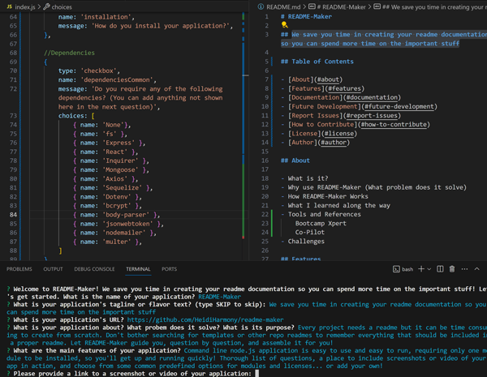

# mmmmmmmmmmmmmmmmmm

## Table of Contents

[About](#about)  
[Features](#features)  
[Installation](#installation)  
[Dependencies](#dependencies)  
[Getting Started](#usage-getting-started)  
[Frequently Asked Questions](#frequently-asked-questions)  
[Plans for Future Development](#plans-for-future-development)  
[Report Issues](#report-issues)  
[How to Contribute](#how-to-contribute)  
[License](#license)  
[About the Author](#about-the-author)

Find this app at www.icry.com

## Description

### About

ibubuhbyuhbuhb

### Features

hjbiubibnihn

### Check out mmmmmmmmmmmmmmmmmm in Action

## Documentation

### Installation

kkkkkkkkkkkk
### Dependencies

None 

### Usage: Getting Started

jgjgjgjgjg

## Frequently Asked Questions

Q:
A:
Q:
A:
Q:
A:

## Plans for Future Development

jjjj

## Report Issues

jnjn

## How to Contribute

fxdfxcdf

## License

Licensed under [MIT](https://choosealicense.com/licenses/MIT)

## About the Author

### Name

knjn

### GitHub

yvyvu

### Email

vybuin@gmail.com

### LinkedIn

www.bummer.com

### Portfolio

www.waghhhh.com

### About Author

fjfjfjf
