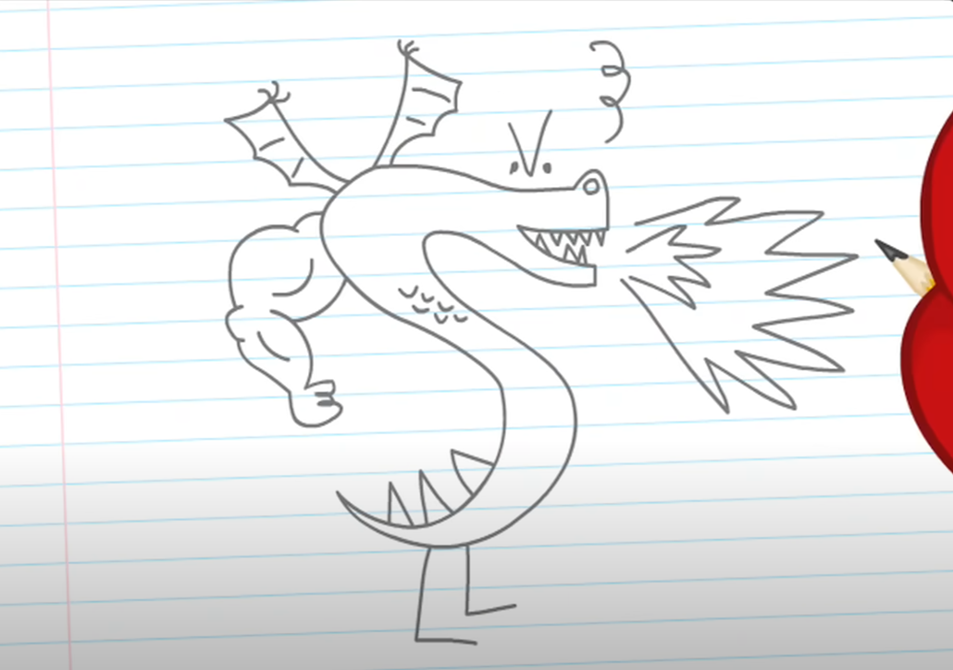

# kjnaksjcnaskc

sacasc

## Table of Contents

[About](#about)  
[Features](#features)  
[Installation](#installation)  
[Dependencies](#dependencies)  
[Getting Started](#usage-getting-started)  
[Frequently Asked Questions](#frequently-asked-questions)  
  
[Plans for Future Development](#plans-for-future-development)  
[Report Issues](#report-issues)  
[How to Contribute](#how-to-contribute)  
[License](#license)  
[About the Author](#about-the-author)

(dvaccacssac)

## Description

### About

casascascasc

### Features

adasdsadca

### Check out kjnaksjcnaskc in Action

## Documentation

### Installation

sdasdasdc

### Usage: Getting Started

ankjas

## Frequently Asked Questions

Q:
A:
Q:
A:
Q:
A:

## Plans for Future Development

sjcisnccn

## Report Issues

dlvnsdkjnvkdjv

## How to Contribute

dcnalkkaskcn

## License

Licensed under [Apache](https://choosealicense.com/licenses/Apache)

## About the Author

### Name

dcjnakjc

### GitHub

asdlckalkcn

### Email

(akdscjnakjcn)

### LinkedIn

(sdlklksd)

### Portfolio

(sdlkvndlkvndklv)

### About Author
ksaclksanclaksnc